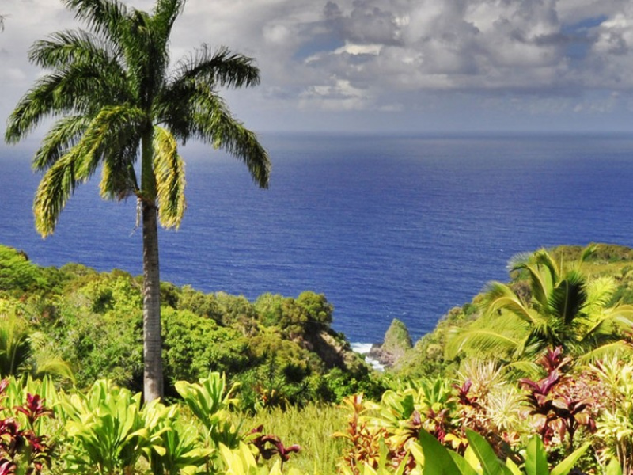
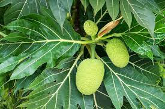
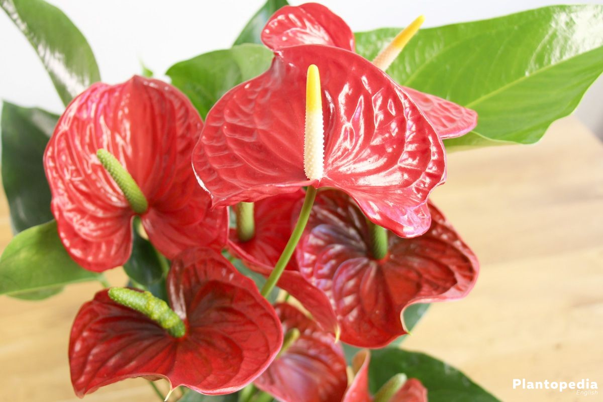
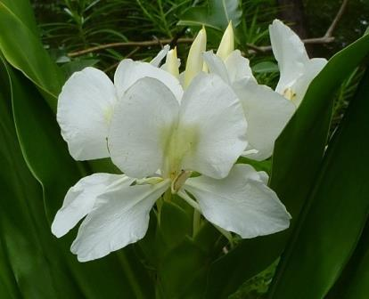

# HiAina Garden App  
### A catalog of native Hawaiian plants!

Hawaiian Plants A-Z!

[A](main/README.md#r)

# A
# B

## Bread Fruit

__Ulu'__

_Artocarpus altilis_
###### Purpose:
Is eaten as a potato substitute of some people, eaten as a fritter or snack for others.

###### To Grow:

# C
# D
# E
# F
# G
# H
# I
# J
# K
# L

## Lace Leaf

_Anthuriums_

###### Purpose: 
In Hawaii Anthuriums are mostly used as decorative plants. They are used in bouquets to give to others and decorate homes or placed at loved ones' graves.

###### Care Instructions: 
Anthuriums are shade plants, they prefer indirect sunlight and are sensitive to the sun, love humidity, and are very sensitive plants. They should be watered when the soil is moist, but drying out, and watered until the water starts draining out of its pot’s drainage hole. To keep it healthy and blooming it should be fed weekly with fertilizer that is rich with phosphorus.

# M
# N
# O
# P
# Q
# R
# S
# T
# U
# V
# W

## White Ginger

__Awapuhi Ke'oke'o__

_Hedychium coronarium_
###### Purpose:

White ginger is commonly grown in many places in Hawaii, like in the wild and in gardens. It is grown as a decorative plant for homes, for the flower’s strong scent, and for lei’s or haku’s.
###### To Grow:

White ginger could be grown just from a piece of the plant's root or a section of the plant's root and stock. It takes a few months for it to start growing stalks and blooms in summer for around 4-6 weeks. This plant likes shade and plenty of water, and should have a maximum 2 hours of sun.

# X
# Y
# Z
