# HiAina Garden App  
### A catalog of native Hawaiian plants!

Hawaiian Plants A-Z!

[A](https://coyanx1.github.io/#a)
[B](https://coyanx1.github.io/#b)
[C](https://coyanx1.github.io/#c)
[D](https://coyanx1.github.io/#d)
[E](https://coyanx1.github.io/#e)
[F](https://coyanx1.github.io/#f)
[G](https://coyanx1.github.io/#g)
[H](https://coyanx1.github.io/#h)
[I](https://coyanx1.github.io/#i)
[J](https://coyanx1.github.io/#j)
[K](https://coyanx1.github.io/#k)
[L](https://coyanx1.github.io/#l)
[M](https://coyanx1.github.io/#m)
[N](https://coyanx1.github.io/#n)
[O](https://coyanx1.github.io/#o)
[P](https://coyanx1.github.io/#p)
[Q](https://coyanx1.github.io/#q)
[R](https://coyanx1.github.io/#r)
[S](https://coyanx1.github.io/#s)
[T](https://coyanx1.github.io/#t)
[U](https://coyanx1.github.io/#u)
[V](https://coyanx1.github.io/#v)
[W](https://coyanx1.github.io/#w)
[X](https://coyanx1.github.io/#x)
[Y](https://coyanx1.github.io/#y)
[Z](https://coyanx1.github.io/#z)

#### Our Promise
We here at HiAina have a dedication to the preservation of the Hawaiian islands.
We seek to educate and provide guidance to gardeners on the islands, to preserve the land with proper information and techniques. 

# A

## Aloe / Aloe Vera
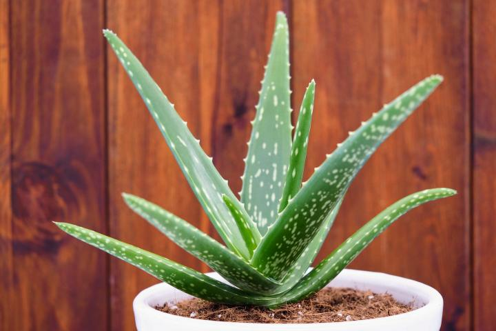

__Alo’e__

_Aloe barbadensis miller_

###### Purpose: 
Aloe is commonly used as decoration for a home or a remedy to relieve sunburn, as skin treatments, and for other medical purposes.
 
###### Care Instructions: 
Aloe vera needs plenty of sunlight, to be watered regularly, and well drained soil/pot. It's important not to over water aloe and to only water after the soil starts to become dry again.

## Arabian jasmine
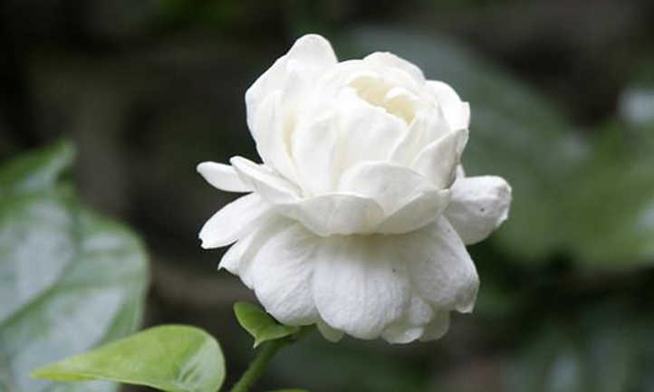

__Pikake__

_Jasminum sambac_

###### Purpose:  It is grown as a decorative plant for homes, for the flower’s strong scent, and for lei’s or haku’s. 
###### Care Instructions: Should be grown in full sun and only watered if its soil is almost completely dry or around 2 a week. It should also be trimmed and cut back when it starts to get too big.

# B

## Bread Fruit

__Ulu'__

_Artocarpus altilis_
###### Purpose:
Is eaten as a potato substitute of some people, eaten as a fritter or snack for others.

###### To Grow:
Grown from a seed breadfruit can take 5 to 10 years until it starts to produce fruit. To start from a seed, it should be grown in moist soil with direct sunlight misted daily with a spray bottle. An adult or premature breadfruit tree should be watered once, daily, thoroughly and regularly during the morning or afternoon.

## Bird of Paradise
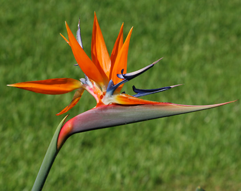

_Strelitzia reginae_

###### Purpose:
In Hawaii birds of paradise are mostly used as decorative plants. They are used in bouquets to give to others, decorate homes or placed at loved ones' graves.
 
###### Care Instruction:
Birds of paradise grow best in full sun, if the sun is too harsh partial sun is best. Watering should only be done when soil starts to feel dry to prevent overwatering, only water enough to make the soil moist and don't water again until the soil is dry again. When it becomes cooler the water is even less.

# C
# D
# E
# F
# G

## Ginger (Bitter)
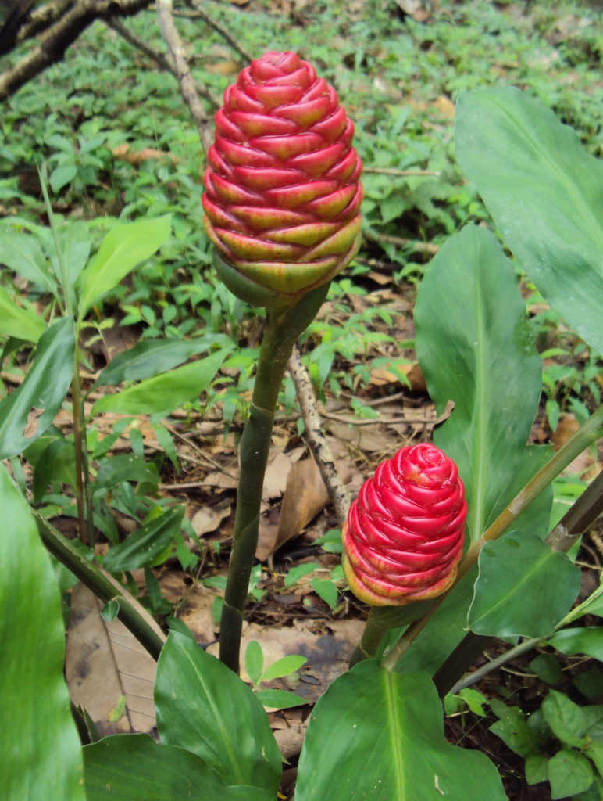

__‘awapuhi__

_Zingiber zerumbet_

###### Purpose:
Can be used as a compress of bruises, cuts, sores, and as other forms of natural medicine. They are mostly used today as decorative plants, in bouquets to give to others, decorate homes or placed at loved ones' graves.
###### Care Instructions:
They should be watered regularly when the soil starts becoming dry to the touch, should be in a cool area with full sun. You can also plant the roots after soaking them in warm water overnight and plant with care the next day.

# H

## Hibiscus
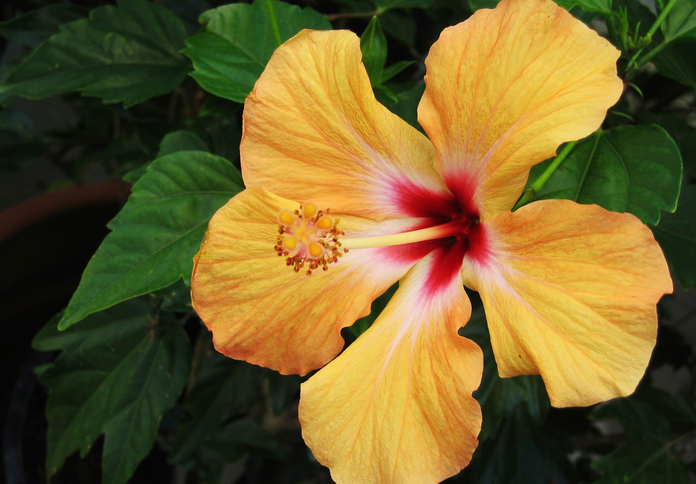

__Kokiʻo ʻula or Aloalo__

_Hibiscus_

###### Purpose:
Are used in teas, tinctures, and natural remedies, as well as professional medicine. Hibiscus come in an array of many colors so they are used very often as decorations in homes, lei’s, hair, ect.

###### Care Instructions:
Hibiscus grows best in full sun, if the sun is too harsh partial sun is best only in the hottest part of the day or the flowers will suffer from too much shade. They should be watered a maximum of every day but for the best results they should be watered every other day when the soil is almost completely dry.

# I
# J
# K
# L

## Lace Leaf

_Anthuriums_

###### Purpose: 
In Hawaii Anthuriums are mostly used as decorative plants. They are used in bouquets to give to others and decorate homes or placed at loved ones' graves.

###### Care Instructions: 
Anthuriums are shade plants, they prefer indirect sunlight and are sensitive to the sun, love humidity, and are very sensitive plants. They should be watered when the soil is moist, but drying out, and watered until the water starts draining out of its pot’s drainage hole. To keep it healthy and blooming it should be fed weekly with fertilizer that is rich with phosphorus.

## Lobster Claws
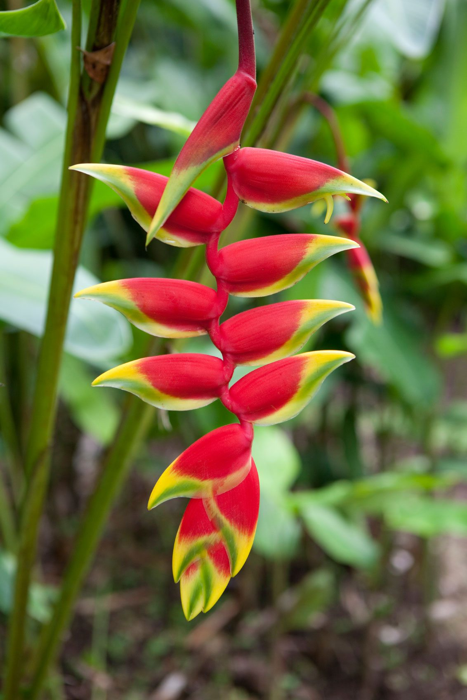

_Heliconias_

# M
 
## Mountain apple
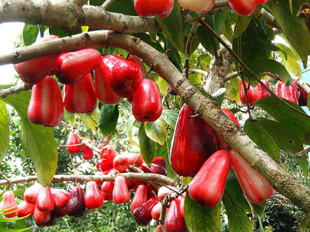

__Ohia Ai__

_Syzygium malaccense_

###### Purpose:
In Hawaii, and other places around the world mountain apples are mostly eaten; they are eaten fresh, pickled, dried, made into wine, and eaten many other ways.

###### Care Instructions:
Mountain apples thrive in full sun and only need to be watered once a week or once every 2 weeks. If planted from a seed it will take 5 years before it starts flowering, but if bought from a nursery as a partly grown tree it will only take 3 years.

# N
# O
# P

## Papaya
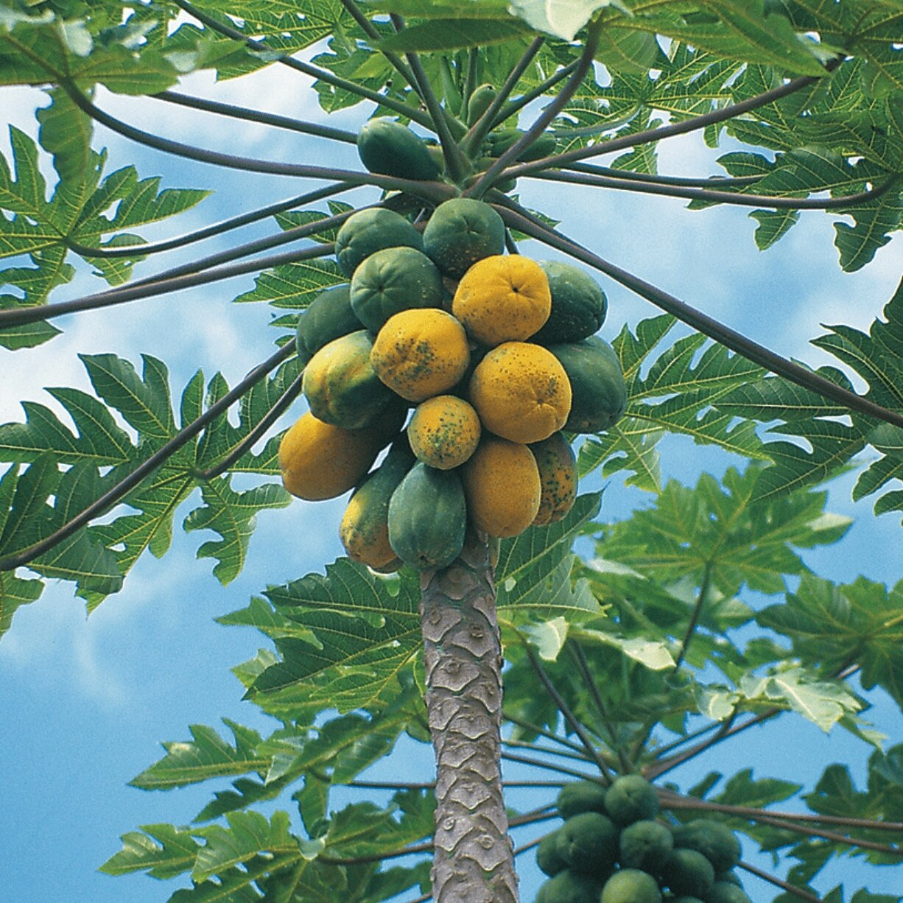

_Carica papaya_

###### Purpose: 
A papaya tree is generally grown to eat, many love it for its sweet flavor and is eaten in many different fresh, chilled, in drinks, bread and other baked goods.
###### Care Instructions:
This tree does best in sunny areas and moist soil that is watered once every day. If in a place that has colder temperatures it should only be watered once the soil is slightly dried out.

## Passion Fruit 
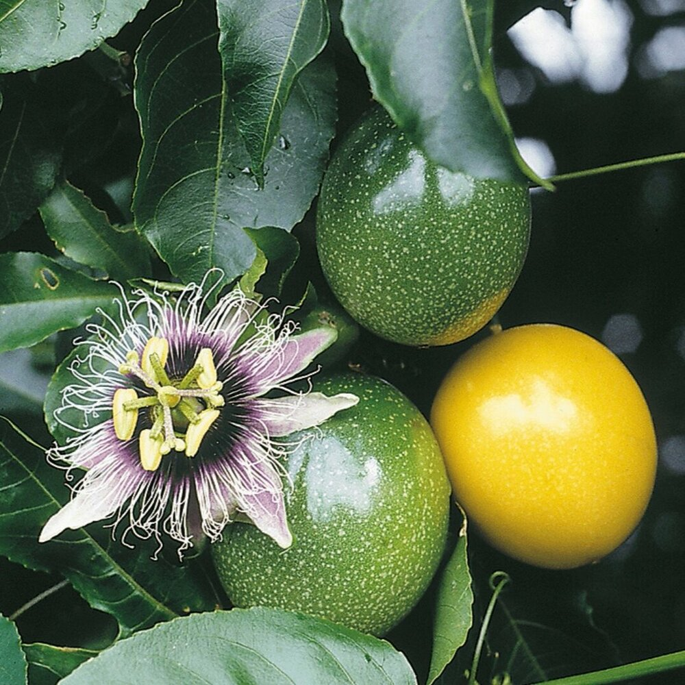

__Lilikoi__

_Passiflora edulis_

###### Purpose: 
Is mostly grown for the fruit, it’s beautiful purple and white flowers produce a ripe yellow or purple fruit (depending on the variety) that has a fragrant and wonderful sweet sour flavor.
###### Care Instructions: 
Passion fruit does best in full sun or partial shade in hotter climates, it should be watered regularly but only when the soil starts to dry and should be planted in an area where the vines can start to climb.

## Plumeria
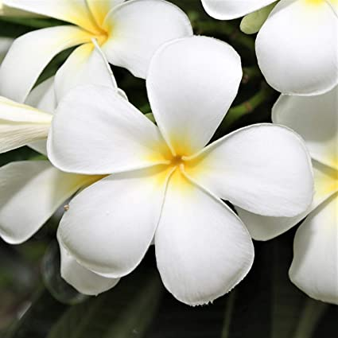

###### Purpose:
Plumeria was used as a natural remedy in Mexico, but today in Hawaii it is known as “poisonous” . Its sap can cause sensitive skin to have minor rashes and if it gets into eyes can cause temporary blindness and is commonly climbed regardless. It comes in a variety of colors, its fragrant flowers are used to decorate houses, in lei’s and haku’s, soaps and perfumes.
###### Care Instructions:
Plumeria trees grow in partial sun with around 6 hours of sun and only need to be watered every two to three weeks.

## Pua- kenikeni
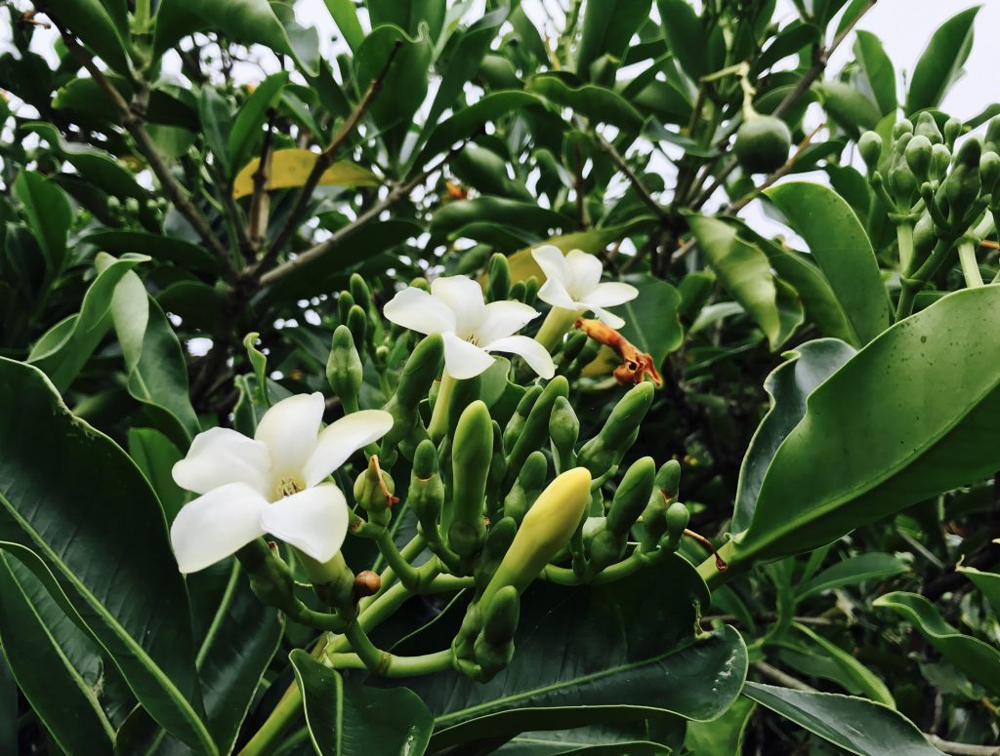

_Fagraea berteroana_
###### Type of Plant: 
Flowering tree
###### Purpose:
It is grown as a decorative plant for homes, for the flower’s strong scent, and for lei’s or haku’s. 
###### Care Instructions:
This lovely tree should be in full sun or partial shade for overly hot climates and watered regularly.

# Q
# R

## Red ginger
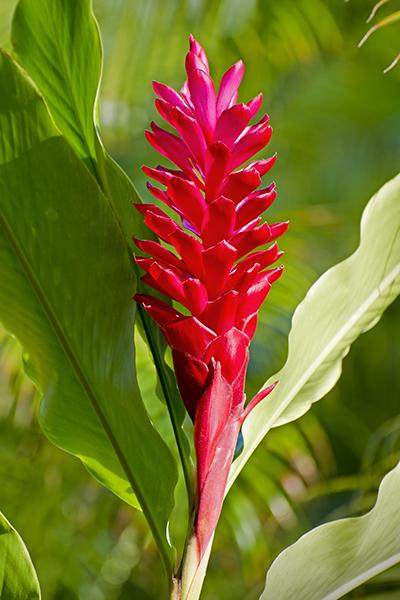

__'awapuhi-'ula'ula__

_Alpinia purpurata_

###### Purpose:
Red ginger can be used as some forms of natural medicine but is mostly used today as a decorative plant, in bouquets to give to others, decorate homes or placed at loved ones' graves.

###### Care Instructions: 
Red ginger is a plant that loves warm, moist climates, with full sun to little shade, and should not be in temperatures that exceed 45 F.

# S
# T

## Tabasco Pepper
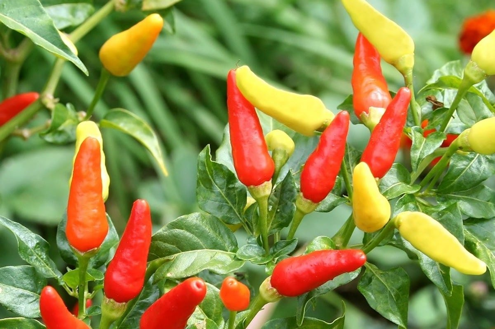

_Capsicum frutescens_

###### Purpose: 
In Hawaii it is mostly used to add flavor and season food; it's put in soy sauce, on fish, as a sauce, in water, and much more.
###### Care Instructions:
The soil should be moist but not too wet or saggy and full sun or partial shade in hotter climates.

## Tahitian Gardenia
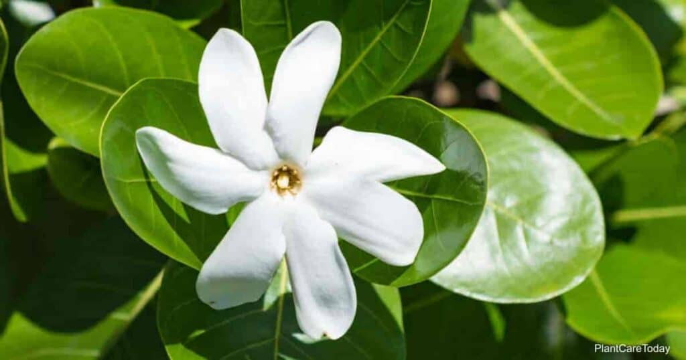

__Tiare__

_Gardenia taitensis_
###### Type of Plant: 
Flowering shrub
###### Purpose:
The tahitian gardenia is used mostly as a decorative flower/plant for it’s looks and sweet fragrance in things like lei’s, haku’s, and perfumes.
###### Care Instructions:
The Tahitian gardenia does well in partial shade especially when growing in an area that has a hotter climate. It should only be watered once a week to every other week unless growing in a hotter climate it should be watered twice a week.

## Ti Leaf
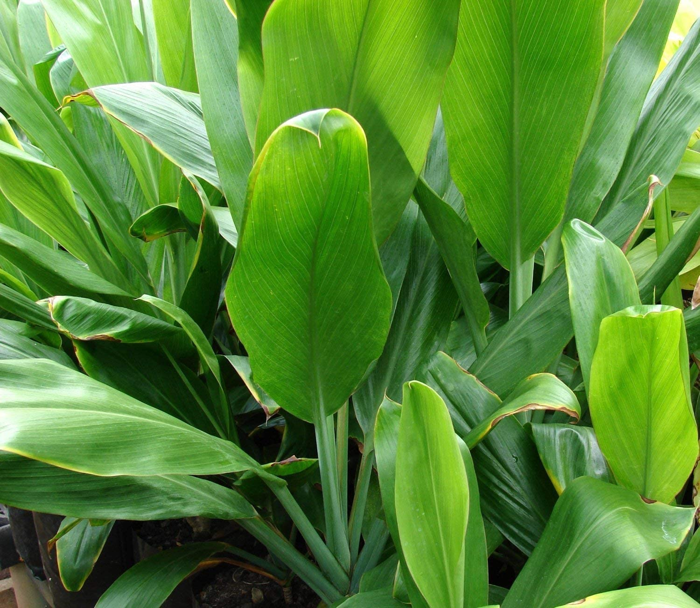

__Lau-Ki__

_Cordyline fruticosa_

## Tumeric
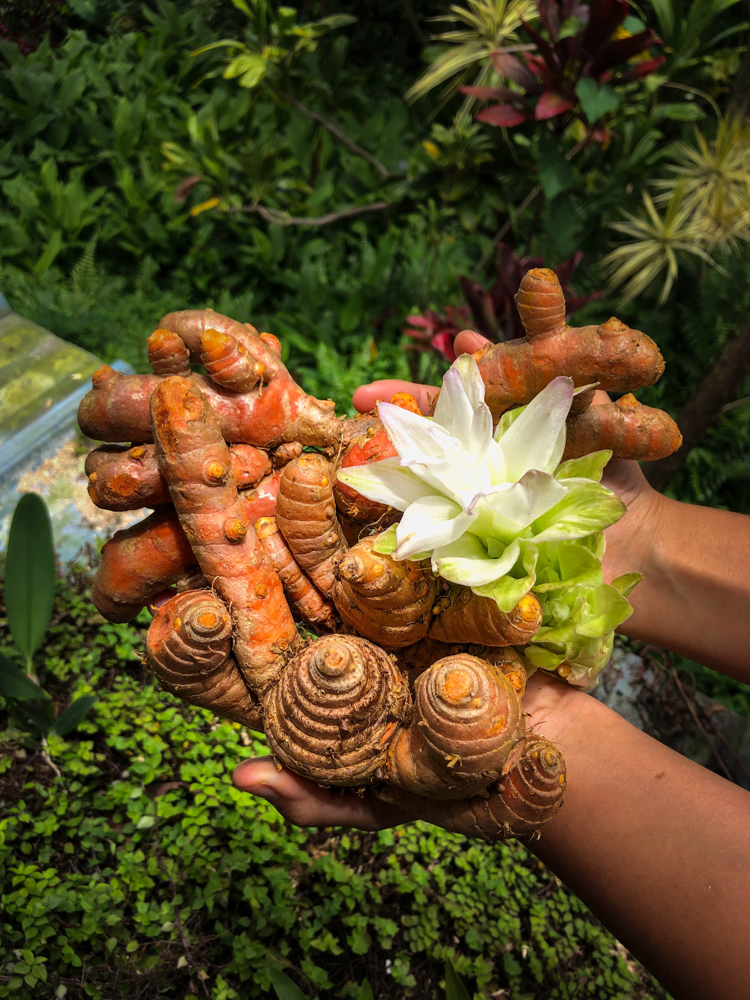

__'Olena__

_Curcuma domestica_

###### Purpose:
Turmeric was introduced to Hawaii by the polynesians, they used it to cure ear infection, nasal ailments, and to purify the blood. The early hawaiians also used its dark yellow/orange color to dye their kapas, today in hawaii it is more commonly used for tonics and seasoning in many dishes.
###### Care Instructions:
It takes around 10 months for turmeric to be harvested after planting, it should be planted in a brightly light place with plenty of sunlight and soil. If planted in a pot it should be transplanted once its roots run out of space. To keep it from going into shock, have at least 50% of it solid with and on the roots.

# U
# V
# W

## White Ginger

__Awapuhi Ke'oke'o__

_Hedychium coronarium_
###### Purpose:
White ginger is commonly grown in many places in Hawaii, like in the wild and in gardens. It is grown as a decorative plant for homes, for the flower’s strong scent, and for lei’s or haku’s.
###### To Grow:
White ginger could be grown just from a piece of the plant's root or a section of the plant's root and stock. It takes a few months for it to start growing stalks and blooms in summer for around 4-6 weeks. This plant likes shade and plenty of water, and should have a maximum 2 hours of sun.

# X
# Y
# Z
